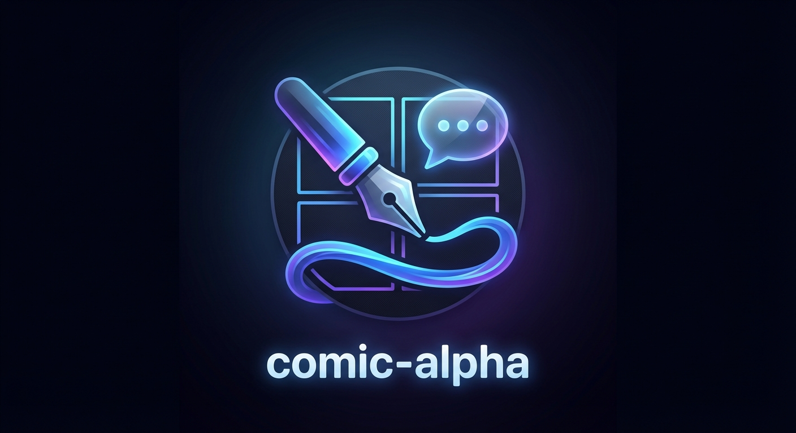
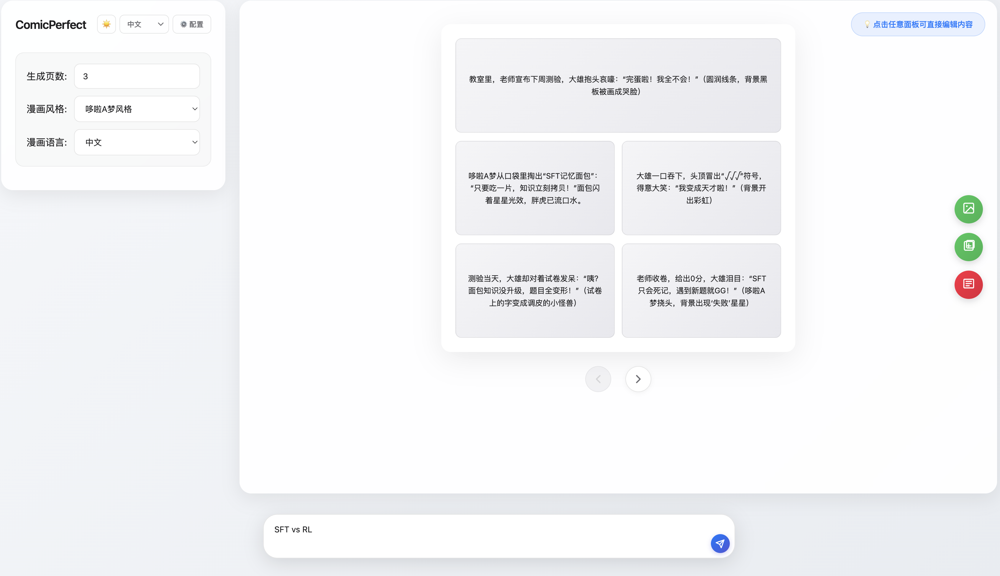
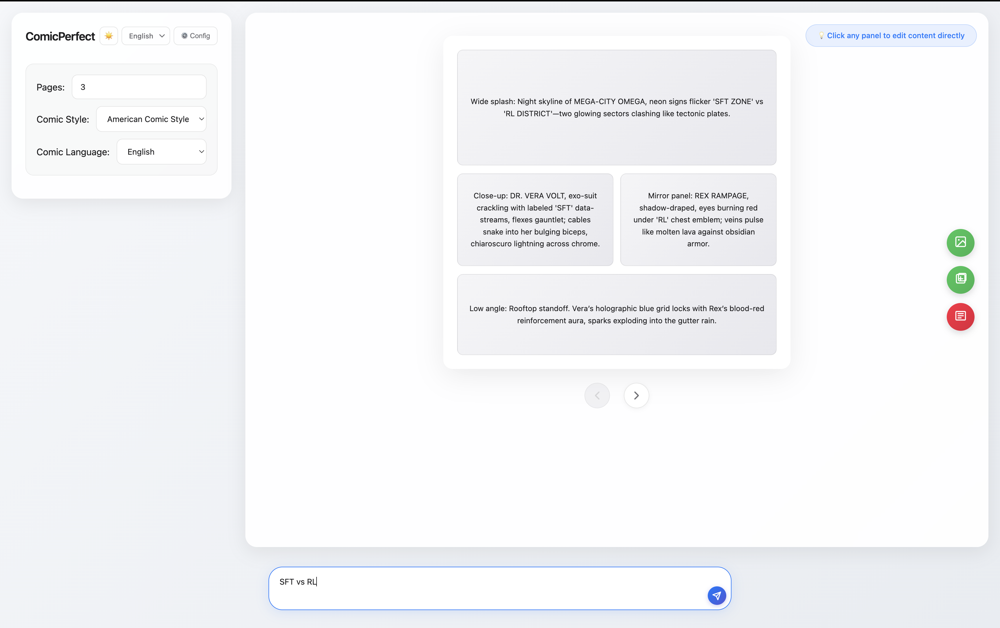
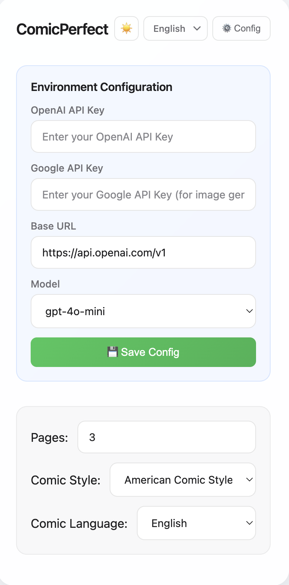

# 🎨 Comic Panel Generator

[](https://www.python.org/downloads/)
[](https://opensource.org/licenses/MIT)

[English](./README.md) | [简体中文](./README_zh.md)

<div align="center">
  
  <h1>Comic Panel Generator</h1>
  <p>An AI-based comic panel script generation tool that supports multi-page comic generation and image export</p>
</div>

## 📸 Screenshots & Examples

### Interface Demos

<table>
<tr>
<td width="50%">

**Chinese Interface**



</td>
<td width="50%">

**English Interface**



</td>
</tr>
<tr>
<td colspan="2">

**Configuration Panel**



</td>
</tr>
</table>

### Generated Comic Examples

<table>
<tr>
<td width="50%">

**Chinese Comic Example**


</td>
<td width="50%">

**English Comic Example**


</td>
</tr>
</table>

> 💡 **See more examples and demos in the [assets folder](./assets/README.md)**

## Project Structure

```
comic_alpha/
├── assets/                     # Demo screenshots and example comics
│   ├── demos/                 # UI screenshots and demos
│   └── examples/              # Generated comic examples
├── backend/                    # Backend service
│   ├── app.py                 # Flask application main file
│   └── requirements.txt       # Python dependencies
├── frontend/                   # Frontend resources
│   ├── css/
│   │   └── style.css         # Style file
│   └── js/
│       ├── i18n.js           # Internationalization module
│       ├── theme.js          # Theme management module
│       ├── api.js            # API call module
│       ├── config.js         # Configuration management module
│       ├── renderer.js       # Rendering module
│       ├── pageManager.js    # Page management module
│       ├── exporter.js       # Image export module
│       └── app.js            # Main controller
├── index.html                 # Main page
└── comic.html                 # Legacy version (preserved)
```

## Tech Stack

### Backend
- **Python 3.8+**
- **Flask**: Web framework
- **OpenAI API**: AI generation capabilities
- **Flask-CORS**: Cross-origin support

### Frontend
- **Vanilla JavaScript**: Modular design
- **HTML5 + CSS3**: Interface
- **html2canvas**: Image export

## Quick Start

### 1. Install Backend Dependencies

This project uses [uv](https://github.com/astral-sh/uv) for fast dependency management.

```bash
cd backend
# Sync dependencies using uv (automatically creates a virtual environment)
uv sync
```

### 2. Start Backend Service

```bash
# Run the application using uv
uv run app.py
```

The backend service will start at `http://localhost:5003`.

### 3. Open Frontend Page

Open the `index.html` file in your browser, or use a local server:

```bash
# Start a simple HTTP server using Python
python -m http.server 8000
```

Then visit `http://localhost:8000`

## Usage Guide

### Interface Settings

#### Theme Toggle
- Click the **🌙/☀️** button in the top right corner to switch between dark mode and light mode
- Theme preferences are automatically saved to local storage
- If no preference is set, it will automatically follow the system theme

#### Language Switch
- Click the language selector in the top right corner to switch between Chinese and English
- Supported languages: Chinese (Simplified), English
- Language preferences are automatically saved

### Configure API

1. Click the **⚙️ Settings** button in the top right corner
2. Enter the OpenAI API Base URL (default: `https://api.openai.com/v1`)
3. Select a model (recommended: `gpt-4o-mini`)
4. Click **💾 Save Configuration**

### Generate Comics

1. Enter your OpenAI API Key
2. Describe the comic content you want in the text box
3. Set the number of pages to generate (1-10 pages)
4. Click **AI Generate Multi-page Panels**
5. Wait for generation to complete

### Edit and Export

- Use the **← Previous Page** / **Next Page →** buttons to browse multi-page comics
- You can directly edit the JSON script, then click **Generate Panels** to re-render
- Click **🎨 Generate Current Page Comic** to convert the sketch into a complete comic image
  - Automatically captures the current sketch as a reference image
  - The generated image will maintain the layout and composition of the sketch
- Click **🎨 Generate All Pages Comics** to batch generate complete comics for all pages
  - Automatically iterates through all pages, generating complete comics page by page
  - Intelligently uses previous pages as references to maintain character and style consistency
  - After generation, you can preview all images
  - Supports individual download or batch download of all generated images
- Click **📱 Generate Xiaohongshu Content** to automatically generate content suitable for Xiaohongshu publishing (New Feature!)
  - Automatically generates attractive titles based on comic content
  - Generates 200-500 word body content with emojis and paragraphs
  - Automatically generates 5-8 relevant topic tags
  - Supports one-click copy of all content
- Click **Download Current Page** to export a single page sketch
- Click **Download All Pages** to batch export all sketch pages

## API Documentation

### Backend API

#### 1. Health Check

```
GET /api/health
```

Response:
```json
{
  "status": "ok",
  "message": "Comic generator API is running"
}
```

#### 2. Generate Comic Script

```
POST /api/generate
```

Request Body:
```json
{
  "api_key": "your-openai-api-key",
  "prompt": "Describe comic content",
  "page_count": 3,
  "base_url": "https://api.openai.com/v1",
  "model": "gpt-4o-mini"
}
```

Response:
```json
{
  "success": true,
  "pages": [...],
  "page_count": 3
}
```

#### 3. Validate Script Format

```
POST /api/validate
```

Request Body:
```json
{
  "script": {...}
}
```

Response:
```json
{
  "valid": true
}
```

#### 4. Generate Final Comic Image

```
POST /api/generate-image
```

Request Body:
```json
{
  "page_data": {
    "title": "Page Title",
    "rows": [...]
  },
  "reference_img": "data:image/png;base64,...",
  "extra_body": {}
}
```

Notes:
- `reference_img` will automatically pass the base64 data of the current sketch
- The generated image will reference the layout and composition of the sketch
- Supports base64 format and URL format

Response:
```json
{
  "success": true,
  "image_url": "Generated image URL",
  "prompt": "Prompt used"
}
```

#### 5. Generate Xiaohongshu Content (New Feature!)

```
POST /api/generate-xiaohongshu
```

Request Body:
```json
{
  "api_key": "your-openai-api-key",
  "comic_data": [
    {
      "title": "Page 1 Title",
      "rows": [...]
    }
  ],
  "base_url": "https://api.openai.com/v1",
  "model": "gpt-4o-mini"
}
```

Notes:
- `comic_data` can be a single page object or an array of pages
- Automatically extracts comic content and generates copy suitable for Xiaohongshu
- Generated content includes title, body, and tags

Response:
```json
{
  "success": true,
  "title": "Attractive Title ✨",
  "content": "Body content with emojis and paragraphs...",
  "tags": ["comic", "AI creation", "Xiaohongshu", ...]
}
```

## Frontend Module Description

### i18n.js - Internationalization
- Supports multi-language switching (Chinese/English)
- Uses localStorage to persist language preferences
- Provides translation functions and UI update mechanisms

### theme.js - Theme Management
- Supports dark/light mode switching
- Automatically detects system theme preferences
- Uses localStorage to persist theme settings
- Smooth theme transition animations

### config.js - Configuration Management
- Manages user configuration (API Key, Base URL, Model)
- Uses localStorage for persistent storage

### api.js - API Calls
- Encapsulates all backend API calls
- Unified error handling

### renderer.js - Rendering Engine
- Renders JSON data into comic panels
- Supports custom styles

### pageManager.js - Page Management
- Manages multi-page comic state
- Provides page navigation functionality

### exporter.js - Image Export
- Single page export
- Batch export
- Uses html2canvas to generate high-quality images

### app.js - Main Controller
- Coordinates all modules
- Handles user interactions
- Manages application state

## JSON Script Format

```json
{
  "title": "Comic Title",
  "rows": [
    {
      "height": "180px",
      "panels": [
        { "text": "Panel description text" },
        { "text": "Another panel", "bg": "#f0f0f0" }
      ]
    }
  ]
}
```

### Field Description

- `title`: Page title (optional)
- `rows`: Array of panel rows
  - `height`: Row height (default 150px)
  - `panels`: Array of panels
    - `text`: Panel description text
    - `bg`: Background color (optional)

## Development Guide

### Adding New Features

1. **Backend Features**: Add new routes in `backend/app.py`
2. **Frontend API**: Add corresponding call methods in `frontend/js/api.js`
3. **UI Interactions**: Add control logic in `frontend/js/app.js`

### Customizing Styles

Edit the `frontend/css/style.css` file to modify the interface styles.

### Extending the Renderer

Modify the `_createPanel` method in `frontend/js/renderer.js` to support more panel styles.

## FAQ

### Q: Generation failed, showing "Failed to fetch"
A: Make sure the backend service is running (`python backend/app.py`), and check if the Base URL configuration is correct.

### Q: How to use a custom model?
A: Select "Custom Model" in the configuration panel, then enter the model name (e.g., `kimi-k2`).

### Q: Image export failed
A: Make sure the html2canvas library is loaded, and check the browser console for error messages.

### Q: How to deploy to production?
A: 
1. Deploy the backend using Gunicorn or uWSGI
2. Host the frontend using Nginx or another web server
3. Configure CORS to allow the frontend domain to access the backend

## License

MIT License

## Contributing

Issues and Pull Requests are welcome!

